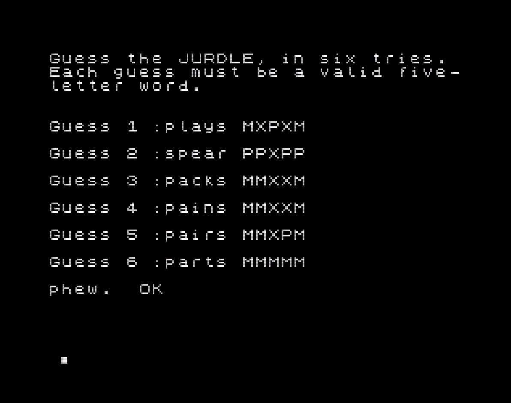

# Jurdle

Jurdle is a blatant Wordle clone, for the 48K expanded Jupiter Ace and compatibles (Minstrel 4th).

The tap file has been tested on the following:
* Minstrel 4th & Jester Ace SD loader
* [Eighty One Emulator](http://www.jupiter-ace.co.uk/emulators_win.html#eightyone), in 51K Jupiter Ace Mode



## Usage

Run the .tap file using your method of choice in emulator or hardware.
You will require a 48K expansion to load the 5,000+ word list.

 ```
 load fivewords
 game
 ```

 ## Development Notes

 Source code is provided for interest and reference.  Forth was entered using the EightyOne emulator, using the [second edition manual](http://jupiter-ace.co.uk/usermanual.html) as a constant reference.  The random routines are directly lifted from here.

 [This article on building Tut-Tut for the Jupiter Ace](http://www.zx81keyboardadventure.com/2020/05/tut-tut-on-jupiter-ace-part-2.html) provided the inspiration for compiling the word list using z80asm and then loading it directly in to memory via the emulator.  [Tut Tut](https://github.com/markgbeckett/jupiter_ace/tree/master/tut-tut) is great, you should check it out here.

The word list used is from [the Stanford GraphBase](https://www-cs-faculty.stanford.edu/~knuth/sgb.html) and is used for some of the examples in the Art of Programming.  The list is in the public domain, and comes in at > 5,000 words.  The game uses the same word list for sourcing and validation, this can lead to some esoteric choices.

## Building

There is no makefile, it's all by hand.  Sorry, not sorry.

1. Build the wordlist using [z80asm](https://www.nongnu.org/z80asm/) (you can also build your own word list this way):

```
z80asm –L –o fivewords.bin fivewords.asm
```
The label END will give you the length of allocated memory after the word list.  Convert this to decimal.

2. Enter all the Forth in EightyOne.  The const FIVEWORDS now holds the address for the wordlist.
```
FIVEWORDS .
```
3. File -> "Load Memory Block", select the compiled assembler (.bin), and enter the address returned from FIVEWORDS.  Load the file.
4. Test the word list has loaded successfully with the following (should return aargh):

````
FIVEWORDS 5 TYPE
````
5. Remember to save to tape periodically, and save the tape file (Tools ... Tape Manager):

```
SAVE fivewords
```

## Contributing
This project is ... done.  However, if you spot something glaring or interesting, pull requests are welcome. For major changes, please open an issue first to discuss what you would like to change.

## License
[MIT](https://choosealicense.com/licenses/mit/)
